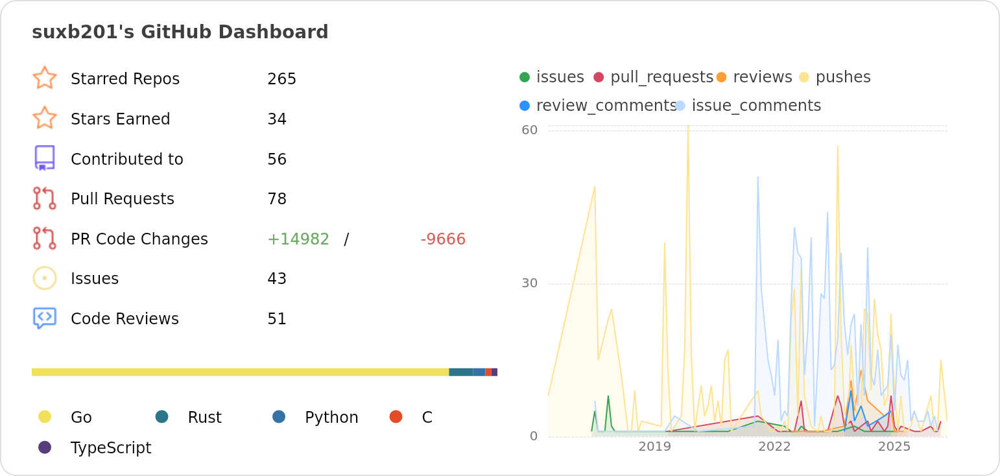

### Hi there 👋

I work at [Tair](https://www.aliyun.com/product/tair), focusing on KV database development.

Open source projects I maintain:

- [RedisShake](https://github.com/tair-opensource/RedisShake) - Redis/Valkey data processing and migration tool
- [resp-benchmark](https://github.com/tair-opensource/resp-benchmark) - Benchmark tool for RESP protocol databases
- [tair-pulse](https://pypi.org/project/tair-pulse/) - Tair monitoring and diagnostics
- dynamo-benchmark - DynamoDB benchmark tool

<a href="https://next.ossinsight.io/widgets/official/compose-user-dashboard-stats?user_id=16659368" target="_blank" style="display: block" align="center">
  <picture>
    <source media="(prefers-color-scheme: dark)" srcset="images/stats-dark.png" width="771" height="auto">
    
  </picture>
</a>
